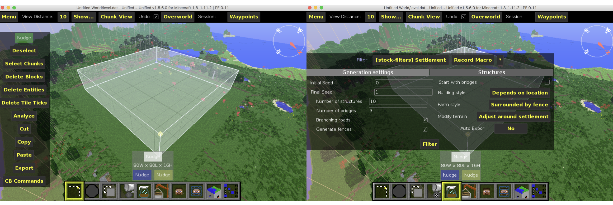
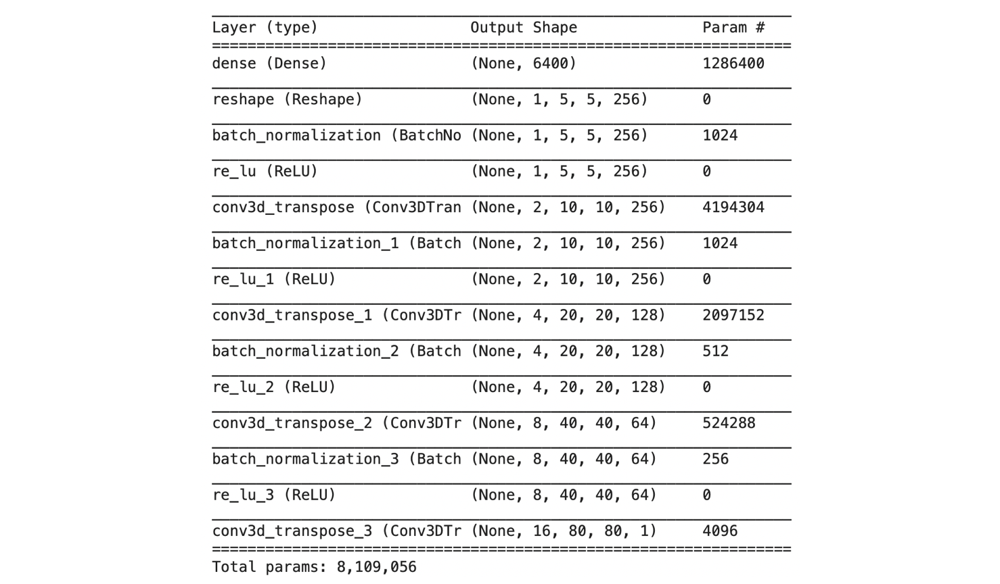
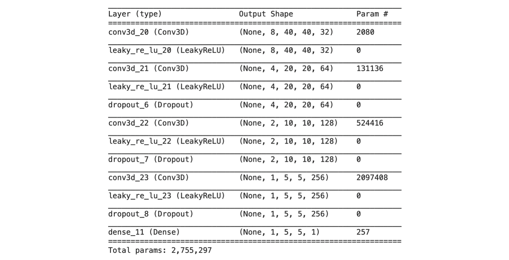
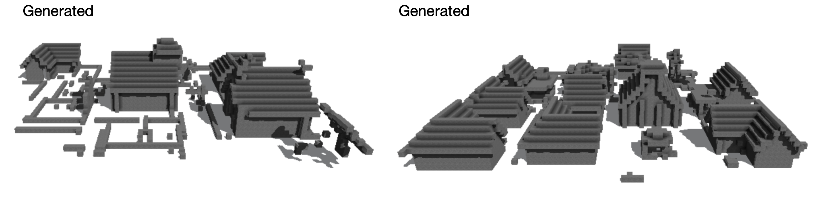
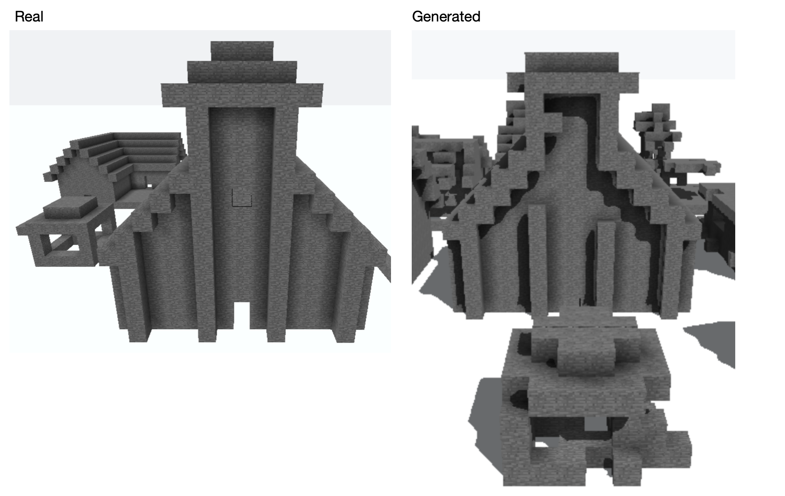
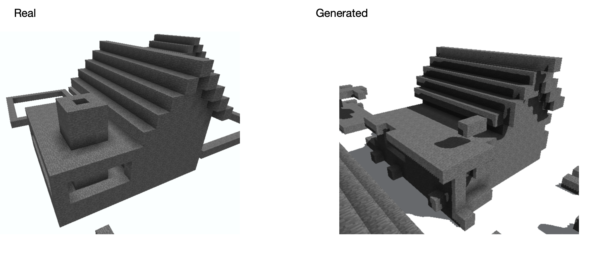
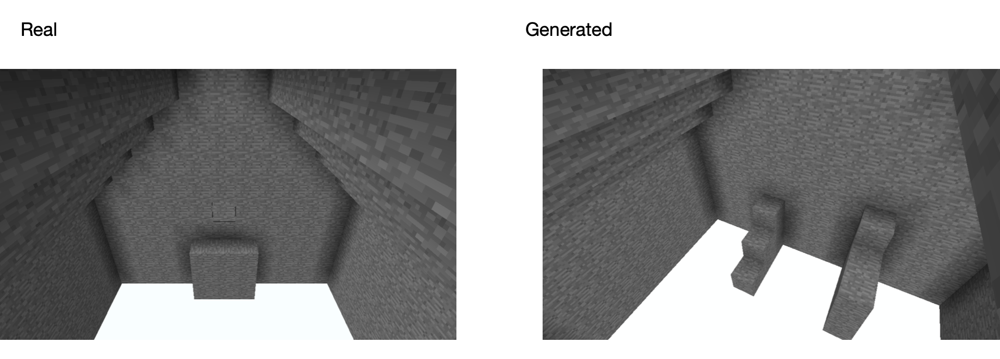
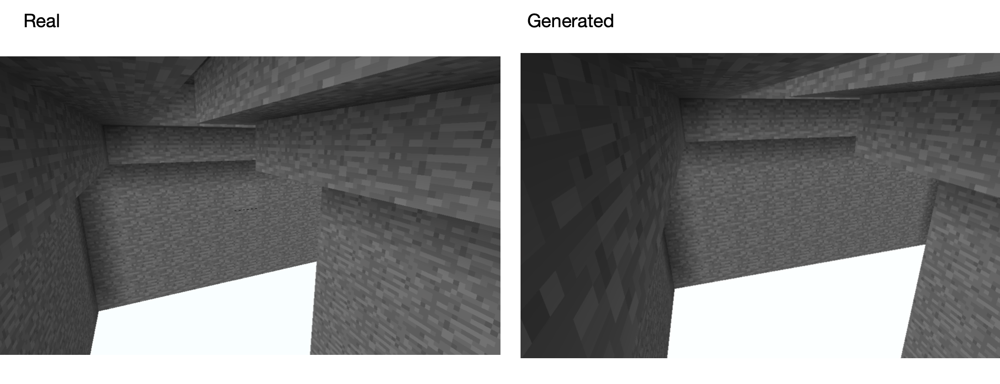
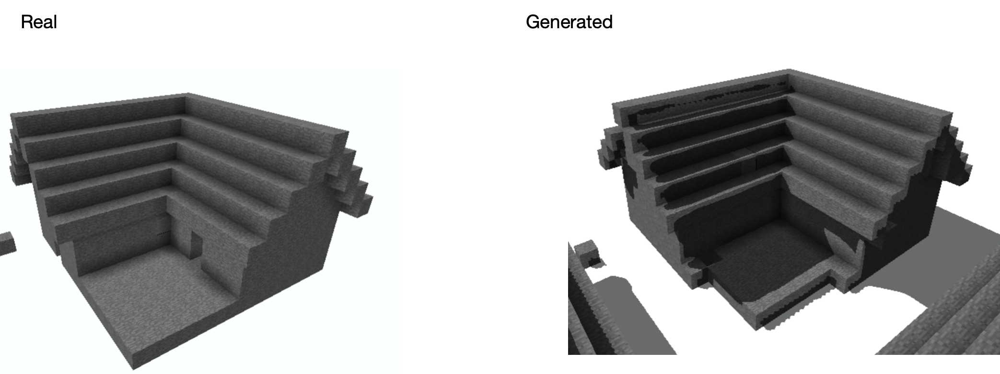

## Minecraft Settlement 3D-GAN

Procedural Content Generation (PCG) is an area that, in the last few years, with the coming of the Artificial Intelligence, it is becoming a field in which more and more research is being done. Minecraft is a game that could be considered one of the most famous games in content generation, but it is well known that the quality of the settlements generated by the game are very primitive. This dissertation provides Deep Learning models that would be able to generate 3D complex Minecraft settlements. In specific, this project describes the Generative Adversarial Network (GAN) framework that is used to create the models, explaining the theories behind it. Then, the 3D-DCGAN and 3D-WGAN architectures are defined. GANs are data driven models and for this reason they need a data set made by Minecraft settlements, that in literature does not exist. This data set is created in this work and the building algorithm is provided. The 3D-WGAN is the only architecture that is able to generate only basic settlements, thus without the materials’ information of the voxels. The results achieved are unique in this area, and they could be a stimulating starting point for the 3D complex objects generation in games and architecture.

### Data set

The Building of the data set took place on a personal computer with macOS 10.13 as operating system and Python 2.7 installed. These two elements are a requirement for the latest version of [MCEdit](https://www.mcedit-unified.net). I have used the latter software with different public filters in order to generate a data set of settlements of 80x80x16 as resolution.

### Network Architecture

The process of finding a good enough model is long. The starting point of this research is inspired on the [3D-IWGAN](https://arxiv.org/pdf/1707.09557.pdf) work, and it has been used as base. At the beginning of this research phase the 3D-IWGAN model has been implemented in order to test its architecture with a different task which is the settlement generation. However, the code of this work is written in the first version of TensorFlow. This created quite a few problems because almost all the functions and the libraries in this first version are deprecated. Moreover, looking on internet at different 3D convolutional projects, it is almost impossible to find some code in the new TensorFlow version, complicating this project’s implementation part. The standard TensorFlow version used now is the 2.6 which is incompatible with the first version. Therefore, the next step was to understand the architecture and the decisions made behind its design. This process helped the project developing its own models that in addition are implemented in the new TensorFlow version.
The best model's architecture is showed here below. The essential part is that the generator is formed of subsequent deconvolution and the discriminator is formed of following convolution for both this project’s architecture, that are called 3D-DCGAN and 3D-WGAN. The first model is the following:
Generator:

Discriminator:

### Results

The best results were obtained with the 0-1 data set where the information of the voxel is described with 0 and 1, thus, there is or there is not a block.

Examples of two generated settlements:

Details inside the settlements:

### Credits

The following files were modified to be adapted to this project:

MCEdit filter: https://www.reddit.com/r/Minecraft/comments/b4l1cc

schematic.py: https://github.com/cbs228/nbtschematic

SchematicTools.py: https://github.com/BluShine/Minecraft-GAN-City-Generator

### License

[GNU GPLv3](LICENSE.txt)
